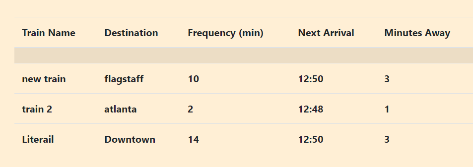

#Train Tracker

Deployment-
https://phil4lif.github.io/train-schedule/

This application is for users to enter data about specific trains or busses that they need to display.  The trains that the user adds will be displayed in a table and will update every minute with accurate schedule information.

##How to Use
This web application requires the user to authenticate using either github or google.  By doing so they are able to save the train schedule information specific to their user's auth id.

#Built With
Bootstrap
JQuery
Momentjs
Firebase
